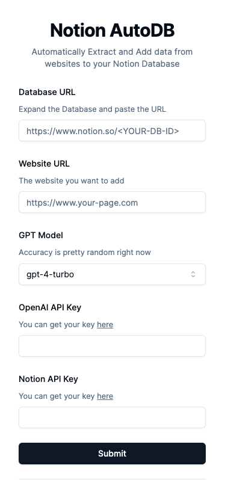

# Notion Auto DB

Automatically Extract and Add data from websites according to your Notion Database Fields!

Tech Stack:

- [Jina AI](https://jina.ai/) - Converts websites to LLM friendly input
- [Instructor (JS)](https://js.useinstructor.com/) - Structured Output Extraction
- [Notion JS SDK](https://github.com/makenotion/notion-sdk-js) - Reads and Adds data to your Notion workspace
- [Zod](https://zod.dev/) - Dynamically define schema for Instructor
- [Next.js](https://nextjs.org/) - Frontend Framework
- [Shadcn](https://ui.shadcn.com/) - UI Component Library
- [OpenAI](https://platform.openai.com/docs/overview) - LLM
